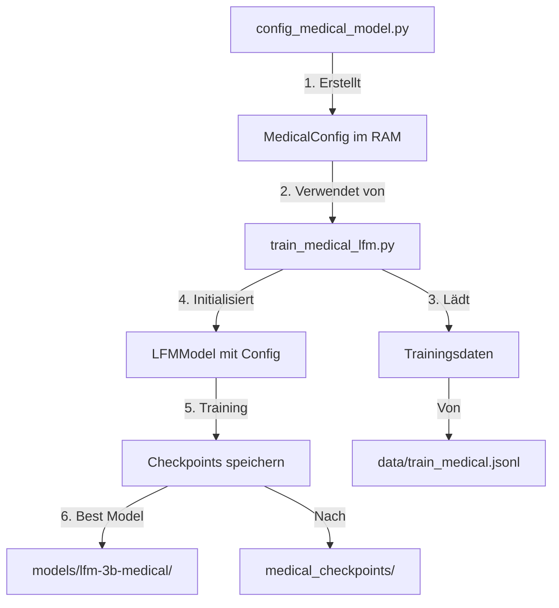

# Medical Model Workflow - Speicherorte und Ablauf

## Übersicht der Komponenten und Speicherorte

### 1. **Konfigurationsdateien**

```
LFM-Liquid-AI-Liquid-Foundation-Models/
├── config_medical_model.py          # Medical-spezifische Konfiguration
├── lfm/
│   ├── config.py                   # Basis LFMConfig Definitionen
│   ├── medical_moe.py              # Medical MoE Implementation
│   └── model_v2.py                 # LFMModel Implementation
```

### 2. **Datenfluss beim Ausführen von config_medical_model.py**

```python
# SCHRITT 1: Konfiguration erstellen (im Speicher)
medical_config = create_medical_config("LFM-3B")
# → Erstellt MedicalConfig Objekt im RAM
# → Enthält: base_config (LFMConfig) + medical features
```

### 3. **Was wird wo gespeichert?**

#### A) **Während der Konfiguration** (config_medical_model.py)
```
Im Speicher (RAM):
├── MedicalConfig Objekt
│   ├── base_config (LFMConfig)
│   │   ├── model_name: "LFM-3B-Medical"
│   │   ├── num_experts: 12
│   │   └── ... andere Parameter
│   ├── medical_specialties: [Liste der 12 Fachgebiete]
│   ├── use_safety_gates: True
│   └── confidence_threshold: 0.85

Keine Dateien werden gespeichert!
```

#### B) **Während des Trainings** (train_medical_lfm.py)
```
medical_checkpoints/
├── epoch_1/
│   ├── model.pt                    # Model Gewichte
│   ├── optimizer.pt                # Optimizer State
│   └── config.json                 # Konfiguration
├── epoch_2/
│   └── ...
├── best_model/
│   ├── model.safetensors          # Beste Model Gewichte
│   ├── config.json                # Model Konfiguration
│   └── training_args.json         # Training Parameter
└── logs/
    └── training.log               # Training Verlauf
```

#### C) **Nach dem Training**
```
data/
├── train_medical.jsonl            # Vorbereitete Trainingsdaten
├── train_medical.stats.json       # Datenstatistiken
└── medical_dataset/
    ├── dataset_dict.json          # Dataset Metadaten
    └── dataset_info.json          # Dataset Informationen

models/
└── lfm-3b-medical/
    ├── pytorch_model.bin          # Finale Model Gewichte
    ├── config.json                # Model Konfiguration
    ├── tokenizer_config.json      # Tokenizer Konfiguration
    └── special_tokens_map.json    # Spezielle Tokens
```

### 4. **Detaillierter Ablauf**



### 5. **Praktisches Beispiel - Vollständiger Workflow**

```bash
# 1. Daten vorbereiten
python prepare_medical_data_simple.py --output_file data/train_medical.jsonl
# → Speichert: data/train_medical.jsonl
# → Speichert: data/train_medical.stats.json

# 2. Konfiguration testen (nichts wird gespeichert)
python config_medical_model.py
# → Zeigt nur Konfigurationsdetails an

# 3. Training starten
python train_medical_lfm.py \
    --model_size 3B \
    --data_path data/train_medical.jsonl \
    --output_dir ./medical_checkpoints \
    --num_epochs 5
# → Speichert während Training: medical_checkpoints/epoch_*/
# → Speichert am Ende: medical_checkpoints/best_model/

# 4. Model für Deployment vorbereiten
python export_medical_model.py \
    --checkpoint medical_checkpoints/best_model \
    --output_dir models/lfm-3b-medical
# → Speichert: models/lfm-3b-medical/*
```

### 6. **Wichtige Dateien und ihre Bedeutung**

| Datei | Zweck | Wann erstellt |
|-------|-------|---------------|
| `config.json` | Model-Architektur Parameter | Beim Training/Export |
| `model.pt` / `pytorch_model.bin` | Trainierte Gewichte | Nach Training |
| `model.safetensors` | Sichere Gewichte (Alternative) | Nach Training |
| `optimizer.pt` | Optimizer State für Resume | Während Training |
| `training_args.json` | Training Hyperparameter | Beim Training |
| `dataset_info.json` | Dataset Statistiken | Bei Datenvorbereitung |

### 7. **Speicherplatzbedarf**

```
Geschätzter Speicherbedarf für LFM-3B Medical:
├── Model Checkpoints: ~12 GB pro Checkpoint
├── Finale Model: ~12 GB
├── Trainingsdaten: ~1-5 GB (je nach Größe)
├── Logs: ~100 MB
└── Total: ~40-50 GB für komplettes Training
```

### 8. **Konfigurations-Persistenz**

Die `MedicalConfig` selbst wird nie direkt gespeichert. Stattdessen:

1. **Beim Training**: Die `base_config` (LFMConfig) wird als JSON gespeichert
2. **Medical Features**: Werden in der MedicalMoE Klasse hartcodiert
3. **Beim Laden**: Config wird aus JSON rekonstruiert

```python
# So wird die Config gespeichert (automatisch beim Training)
import json

def save_config(config: MedicalConfig, path: str):
    # Nur base_config wird gespeichert
    config_dict = {
        "model_name": config.base_config.model_name,
        "num_experts": config.base_config.num_experts,
        # ... alle LFMConfig Parameter
    }
    with open(f"{path}/config.json", "w") as f:
        json.dump(config_dict, f)

# So wird sie wieder geladen
def load_config(path: str) -> LFMConfig:
    with open(f"{path}/config.json", "r") as f:
        config_dict = json.load(f)
    return LFMConfig(**config_dict)
```

Die medical-spezifischen Features (specialties, safety_gates, etc.) sind in der `MedicalMoE` Implementation fest eingebaut und müssen nicht separat gespeichert werden.